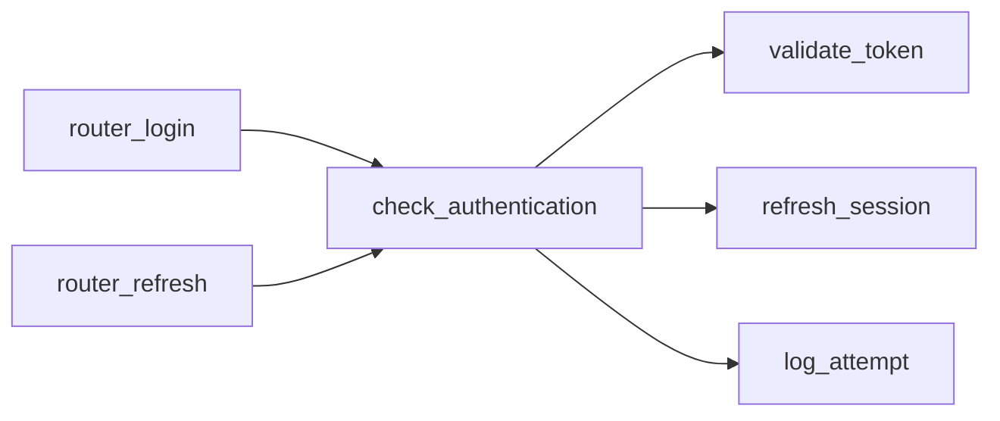

# Cline Workflow with spec-gen MCP

This guide shows how to use spec-gen as an MCP server inside Cline to analyse and
refactor a codebase without leaving the editor.

---

## 1. Setup

### 1a. Build spec-gen

```bash
git clone https://github.com/laurentftech/spec-gen
cd spec-gen
npm install
npm run build
```

### 1b. Add the MCP server in Cline

Open Cline → Settings → MCP Servers → Edit JSON and add:

```json
{
  "mcpServers": {
    "spec-gen": {
      "command": "node",
      "args": ["/absolute/path/to/spec-gen/dist/cli/index.js", "mcp"]
    }
  }
}
```

> If spec-gen is installed globally (`npm install -g spec-gen`), replace the
> command/args with `"command": "spec-gen", "args": ["mcp"]`.

Reload Cline. The 10 spec-gen tools should appear in the MCP panel.

### 1c. Initialize spec-gen in your project (once)

```bash
cd your-project
spec-gen init     # creates .spec-gen/config.json
```

The config lets you declare `excludePatterns` (e.g. `dist/**`, `static/**`) and
`includePatterns` (e.g. `*.graphql`) so the MCP tools respect them automatically.

---

## 2. Tools at a glance

| Tool | When to use |
|------|------------|
| `analyze_codebase` | First call on a project, or after significant code changes |
| `get_refactor_report` | "Where do I start?" — sorted refactoring priorities |
| `get_critical_hubs` | Identify the riskiest functions (most dependents) |
| `get_low_risk_refactor_candidates` | Safe first targets for a refactoring session |
| `get_leaf_functions` | Bottom-up: self-contained functions to extract/rename |
| `get_call_graph` | Architectural overview: layers, entry points, violations |
| `get_signatures` | Public API of a module without reading full source |
| `get_subgraph` | Blast radius of touching a specific function |
| `analyze_impact` | Deep-dive before modifying a function (risk score, strategy) |
| `get_mapping` | Requirement → function traceability after `spec-gen generate` |

---

## 3. Workflow A — First contact with an unfamiliar codebase

### Step 1 — Ask Cline to orient itself

> **You:** I just opened a new project. Can you analyse it and give me an overview?

Cline calls:
```
analyze_codebase({ directory: "/path/to/project" })
```

Example response summary:
```
projectName: kidSearch-backend
projectType: python
frameworks: [FastAPI, SQLAlchemy, Celery]
stats: { files: 143, nodes: 312, edges: 478 }
callGraph: { totalNodes: 312, hubs: 4, entryPoints: 18 }
topRefactorIssues:
  - crawl_json_api_async  (fanOut=14, god function)
  - check_authentication  (fanOut=15, god function + SRP)
  - t                     (fanIn=25, hub overload)
domains: [crawler, auth, embeddings, api, scheduler]
```

### Step 2 — Understand the architecture

> **You:** Show me the call graph — which functions are hubs and are there layer violations?

Cline calls:
```
get_call_graph({ directory: "/path/to/project" })
```

Cline can then explain hub functions, architectural layers, and any
cross-layer calls that bypass the intended dependency direction.

### Step 3 — Browse module signatures without reading files

> **You:** What does the auth module expose?

Cline calls:
```
get_signatures({ directory: "/path/to/project", filePattern: "auth" })
```

Returns compact signatures for every function and class in files matching
`auth` — no need to open files manually.

---

## 4. Workflow B — Incremental refactoring session

This workflow is designed to be run entirely inside Cline, iterating between
analysis and code changes.

### Step 1 — Analyse the project

> **You:** Analyse the project at /path/to/project.

```
analyze_codebase({ directory: "/path/to/project" })
```

Results are cached for 1 hour. Pass `force: true` to re-analyse after changes.

### Step 2 — Find where to start

> **You:** Where should I start refactoring? Give me the top priorities.

```
get_refactor_report({ directory: "/path/to/project" })
```

Example output:
```json
{
  "stats": { "totalFunctions": 266, "withIssues": 7,
             "highFanOut": 5, "highFanIn": 2, "srpViolations": 1 },
  "priorities": [
    {
      "function": "check_authentication",
      "file": "src/auth/auth.py",
      "fanOut": 15,
      "issues": ["high_fan_out", "multi_requirement"],
      "requirements": ["Authenticate User", "Validate Token", "Refresh Session"],
      "priorityScore": 7.5
    },
    {
      "function": "crawl_json_api_async",
      "file": "src/crawler/crawler.py",
      "fanOut": 14,
      "issues": ["high_fan_out"],
      "priorityScore": 6.0
    }
  ]
}
```

### Step 3 — Assess risk before touching a function

> **You:** I want to split `check_authentication`. What's the blast radius?

Cline calls two tools in sequence:

```
analyze_impact({
  directory: "/path/to/project",
  symbol: "check_authentication"
})
```

Returns fan-in (how many callers), fan-out (how many callees), upstream chain
(who ultimately depends on it), risk score 0–100, and a recommended strategy
(e.g. `"extract"`, `"split"`, `"facade"`).

```
get_subgraph({
  directory: "/path/to/project",
  functionName: "check_authentication",
  direction: "both",
  format: "mermaid"
})
```

Renders a Mermaid diagram directly in Cline's response:



Cline can now propose a concrete split strategy backed by actual call data.

### Step 4 — Pick safe first targets

> **You:** Start with something low-risk. What can I safely rename or extract today?

```
get_low_risk_refactor_candidates({ directory: "/path/to/project", limit: 5 })
```

Returns functions with few callers, few dependencies, no cyclic involvement,
and not a hub — the ideal starting points for a session.

```
get_leaf_functions({ directory: "/path/to/project", filePattern: "utils" })
```

Returns self-contained utility functions (no internal calls) — zero downstream
blast radius.

### Step 5 — Make changes, re-analyse

Cline makes the code changes, then calls:

```
analyze_codebase({ directory: "/path/to/project", force: true })
get_refactor_report({ directory: "/path/to/project" })
```

Cline checks that `withIssues` decreased and `priorityScore` dropped for the
functions it just refactored. If not, it investigates why.

---

## 5. Workflow C — Spec-driven refactoring (after `spec-gen generate`)

After running `spec-gen generate -y` once to produce OpenSpec files:

### Check requirement → function traceability

> **You:** Show me which functions implement the auth domain requirements.

```
get_mapping({ directory: "/path/to/project", domain: "auth" })
```

Returns:
```json
{
  "mappings": [
    {
      "requirement": "Authenticate User",
      "functions": [{ "name": "check_authentication", "file": "auth.py",
                      "confidence": "llm" }]
    }
  ],
  "orphanFunctions": [
    { "name": "old_token_helper", "file": "auth.py", "confidence": "llm" }
  ]
}
```

### Find dead code

> **You:** Which functions in the auth module are not covered by any requirement?

```
get_mapping({ directory: "/path/to/project", domain: "auth", orphansOnly: true })
```

Cline can then list the orphan functions and propose deleting or documenting them.

---

## 6. Recommended prompts

### Initial analysis
```
Analyse the project at /path/to/project.
Summarise its architecture, the top refactoring issues, and suggest a starting point.
```

### Targeted refactoring
```
Look at the refactor report for /path/to/project.
Pick the highest-priority function, assess its blast radius, and propose a concrete
refactoring plan with the exact changes needed.
```

### Safe first session
```
I want to start refactoring /path/to/project with low risk.
Find me 3 self-contained functions I can rename or extract today
without breaking anything.
```

### Post-generate traceability
```
spec-gen generate has run. Check the mapping for /path/to/project.
List orphan functions (dead code candidates) and functions with
confidence "heuristic" that need manual verification.
```

---

## 7. Tips

- **Always call `analyze_codebase` first** — every other tool reads from the
  cached analysis. Results are stale after significant code changes; pass
  `force: true` to refresh.
- **Use `analyze_impact` before modifying any function with fanIn > 5** —
  the risk score and recommended strategy save time by ruling out bad approaches
  before writing a single line of code.
- **Combine `get_subgraph` with `format: "mermaid"`** — Cline renders the diagram
  inline, making it easy to see caller chains without opening a separate tool.
- **`get_signatures` before reading source** — for large modules, signatures give
  you the full public API in a few hundred tokens instead of thousands.
- **Iterate: analyze → change → analyze** — the loop is fast (analysis is cached,
  `force: true` re-runs in seconds). Cline can drive the loop automatically if
  you ask it to verify its own changes.
