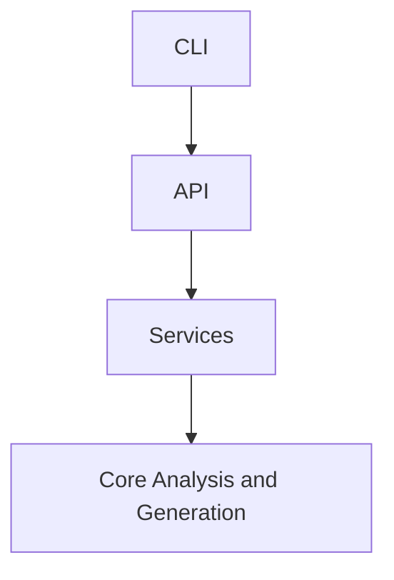

# Architecture Specification

> Generated by spec-gen v1.0.0 on 2026-03-25 21:54

## Purpose

This document describes the architectural patterns and structure of the system.

## Architecture Style

Layered architecture: CLI layer → API layer → service layer → core analysis and generation layer.
This pattern separates concerns and allows for modular development and testing.

## Requirements

### Requirement: LayeredArchitecture

The system SHALL maintain separation between:
- CLI (Handles command-line interface interactions and user input)
- API (Provides HTTP endpoints for interacting with the tool)
- Services (Implements core business logic and operations)
- Core Analysis and Generation (Performs static analysis, generates specifications, and verifies accuracy)

#### Scenario: LayerSeparation
- **GIVEN** a request from the presentation layer
- **WHEN** business logic is needed
- **THEN** the presentation layer delegates to the business layer
- **AND** direct database access from presentation is prohibited

### Requirement: SecurityModel

The system SHALL implement security via: API key management for LLM providers; no explicit authentication/authorization for CLI commands

#### Scenario: AuthenticatedAccess
- **GIVEN** an unauthenticated request
- **WHEN** accessing protected resources
- **THEN** access is denied

## System Diagram

## Layer Structure

### CLI

**Purpose**: Handles command-line interface interactions and user input
**Location**: `src/cli/commands/mcp.ts, src/cli/commands/view.ts, src/cli/commands/spec-gen.ts`

### API

**Purpose**: Provides HTTP endpoints for interacting with the tool
**Location**: `src/api/run.ts, src/api/generate.ts, src/api/init.ts, src/api/drift.ts`

### Services

**Purpose**: Implements core business logic and operations
**Location**: `src/core/services/mcp-handlers/utils.ts, src/core/services/config-manager.ts, src/core/services/llm-service.ts, src/core/services/chat-tools.ts`

### Core Analysis and Generation

**Purpose**: Performs static analysis, generates specifications, and verifies accuracy
**Location**: `src/core/analyzer/call-graph.ts, src/core/analyzer/signature-extractor.ts, src/core/generator/spec-generation-pipeline.ts, src/core/verifier/verification-engine.ts`

## Data Flow

CLI/API request → service layer → core analysis/generation layer → data persistence; async LLM
interactions for generation and verification

## External Integrations

| System | Purpose |
|--------|---------|
| Git | External integration |
| LLM providers (Claude, Mistral, OpenAI-compatible) | External integration |
| LanceDB for vector indexing | External integration |
| tree-sitter for AST parsing | External integration |
