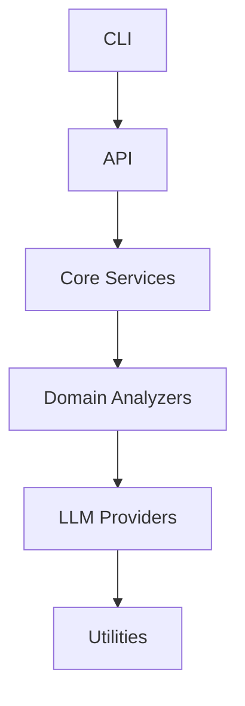

# Architecture Specification

> Generated by spec-gen v1.0.0 on 2026-03-25 22:10

## Purpose

This document describes the architectural patterns and structure of the system.

## Architecture Style

Layered architecture: CLI interface → core services → domain-specific analyzers → LLM providers and
utilities. This pattern separates concerns and allows for modular development and testing.

## Requirements

### Requirement: LayeredArchitecture

The system SHALL maintain separation between:
- CLI (Command-line interface for user interaction and command routing)
- API (HTTP API endpoints for programmatic access)
- Core Services (Business logic and orchestration of the tool's functionality)
- Domain Analyzers (Domain-specific analysis of codebases and specifications)
- LLM Providers (Integration with language model providers)
- Utilities (Supporting utilities and helpers)

#### Scenario: LayerSeparation
- **GIVEN** a request from the presentation layer
- **WHEN** business logic is needed
- **THEN** the presentation layer delegates to the business layer
- **AND** direct database access from presentation is prohibited

### Requirement: SecurityModel

The system SHALL implement security via: No explicit authentication or authorization mechanisms are present in the code. The tool relies on local file system access and assumes users have appropriate permissions.

#### Scenario: AuthenticatedAccess
- **GIVEN** an unauthenticated request
- **WHEN** accessing protected resources
- **THEN** access is denied

## System Diagram

## Layer Structure

### CLI

**Purpose**: Command-line interface for user interaction and command routing
**Location**: `src/cli/commands/mcp.ts, src/cli/commands/view.ts, src/cli/commands/drift.ts`

### API

**Purpose**: HTTP API endpoints for programmatic access
**Location**: `src/api/run.ts, src/api/generate.ts, src/api/init.ts, src/api/drift.ts`

### Core Services

**Purpose**: Business logic and orchestration of the tool's functionality
**Location**: `src/core/services/config-manager.ts, src/core/services/llm-service.ts, src/core/services/chat-tools.ts, src/core/services/mcp-handlers/utils.ts`

### Domain Analyzers

**Purpose**: Domain-specific analysis of codebases and specifications
**Location**: `src/core/analyzer/call-graph.ts, src/core/analyzer/signature-extractor.ts, src/core/analyzer/artifact-generator.ts`

### LLM Providers

**Purpose**: Integration with language model providers
**Location**: `src/core/services/llm-service.ts, src/core/services/chat-tools.ts`

### Utilities

**Purpose**: Supporting utilities and helpers
**Location**: `src/utils/command-helpers.ts, src/core/services/mcp-handlers/utils.ts`

## Data Flow

CLI/API request → core services → domain analyzers → LLM providers → utilities; results are
persisted to disk and can be viewed or processed further

## External Integrations

| System | Purpose |
|--------|---------|
| OpenAI-compatible LLM providers (OpenAI, Ollama, LocalAI, vLLM, LM Studio) | External integration |
| Git for version control and change detection | External integration |
| LanceDB for vector indexing and semantic search | External integration |
